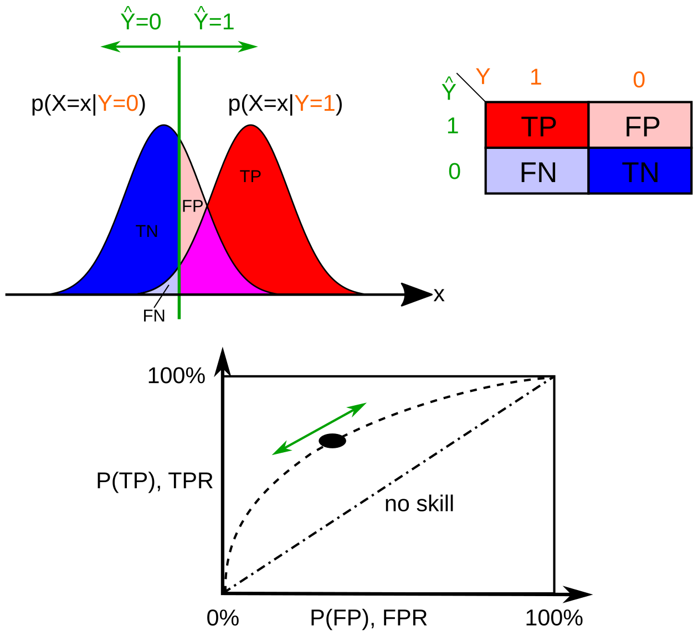

# Statistics method in R

## Week1

Why R?

-   Open-source - in statistics and graphics

-   Widely used.

-   Extensive package in various analysis

-   Community support.

-   CRAN - provides extensive packages

Further reading:

-   

    > 1.  [List of Useful R Functions by Statistics Globe](https://statisticsglobe.com/r-functions-list/)
    >
    > 2.  [List of Useful R Packages by Statistics Globe](https://statisticsglobe.com/r-packages-list)

    

#### Statistical Concepts & Methods Overview

#### This table provides a brief overview of key statistical concepts and methods commonly used in data analysis. Use it as a cheat sheet throughout your course.

| **Method / Term** | **R Function / Package** | **Python Function / Package** | **Description** |
|------------------|------------------|------------------|------------------|
| ANOVA | `aov()`, `anova()` | `statsmodels.stats.anova.anova_lm()` | Tests if means of 3+ groups differ. |
| Binary Logistic Regression | `glm(family=binomial)` | `LogisticRegression` (`sklearn.linear_model`) | Predicts binary outcomes. |
| Bootstrap Resampling | `boot` package | `resample()` (`sklearn.utils`), `bootstrap` (`scipy`) | Estimates statistics via resampling. |
| Central Limit Theorem | Simulation via `replicate()` | Simulations using `numpy`, `matplotlib` | Sampling distribution → normal as N↑ |
| Chi-squared Test | `chisq.test()` | `chi2_contingency()` (`scipy.stats`) | Association between categorical vars. |
| Cluster Sampling | Manual sampling via `dplyr`, `sample_n()` | Manual sampling via `pandas`, `numpy` | Samples entire population clusters. |
| Confidence Intervals | `confint()` | `confint()` (`statsmodels`), `t.interval()` | Range containing true parameter. |
| Confusion Matrix | `caret::confusionMatrix()` | `confusion_matrix()` (`sklearn.metrics`) | Compares actual vs predicted. |
| Contingency Table | `table()`, `xtabs()` | `pd.crosstab()` | Frequency table for categorical vars. |
| Correlation Analysis | `cor()`, `cor.test()` | `pearsonr()` (`scipy.stats`) | Measures linear relationship. |
| Correlation Coefficients | `cor()` | `corr()` (`pandas`) | Strength/direction of correlation. |
| Correlation Matrix | `cor()` | `df.corr()` (`pandas`) | Table of pairwise correlations. |
| Correlation Matrix Visualization | `corrplot::corrplot()` | `seaborn.heatmap(df.corr())` | Color-coded correlation matrix. |
| Decision Tree | `rpart::rpart()` | `DecisionTreeClassifier` (`sklearn.tree`) | Tree-based prediction model. |
| F-test | `var.test()`, `anova()` | `f_oneway()` (`scipy.stats`) | Compares variances between groups. |
| Frequency Tables | `table()`, `summary()` | `value_counts()` (`pandas`) | Count of category values. |
| Kernel Smoothing Regression | `ksmooth()`, `npreg()` | `KernelDensity` (`sklearn.neighbors`), `lowess` (`statsmodels`) | Smooth non-linear regression. |
| Kruskal-Wallis Test | `kruskal.test()` | `kruskal()` (`scipy.stats`) | Non-parametric test for 3+ groups. |
| Levene Test | `car::leveneTest()` | `levene()` (`scipy.stats`) | Tests equality of variances. |
| Mann-Whitney U Test | `wilcox.test()` | `mannwhitneyu()` (`scipy.stats`) | Non-parametric test for two groups. |
| Mean | `mean()` | `mean()` (`numpy`, `pandas`) | Arithmetic average. |
| Mean Squared Error | `mean((actual - predicted)^2)` | `mean_squared_error()` (`sklearn.metrics`) | Avg squared prediction error. |
| Median | `median()` | `median()` (`numpy`, `pandas`) | Middle value. |
| Mode | `Mode()` (`DescTools`) | `mode()` (`scipy.stats`, `pandas.Series.mode`) | Most frequent value. |
| Multinomial Logistic Regression | `nnet::multinom()` | `LogisticRegression(multi_class='multinomial')` (`sklearn`) | Predicts multi-class outcomes. |
| Multiple Linear Regression | `lm()` | `OLS()` (`statsmodels.api`) | Regression with multiple predictors. |
| Point Estimation | `mean()`, `var()`, etc. | `mean()`, `var()` (`numpy`) | Single value estimate. |
| Polynomial Regression | `lm(y ~ poly(x, degree))` | `PolynomialFeatures()` + `LinearRegression()` | Models with polynomial terms. |
| Probability Distributions | `dnorm()`, `rbinom()` etc. | `scipy.stats` (e.g., `norm`, `binom`, etc.) | Defines distribution shapes. |
| Q-Q Plots | `qqnorm()`, `qqline()` | `qqplot()` (`statsmodels.graphics`) | Compares data vs. theoretical dist. |
| Random Forest | `randomForest::randomForest()` | `RandomForestClassifier` (`sklearn.ensemble`) | Ensemble of decision trees. |
| Random Number Generation | `runif()`, `rnorm()` | `numpy.random`, `random` | Random value generation. |
| Range | `range()` | `ptp()` (`numpy`), `max() - min()` | Max - Min. |
| Ridge Regression | `glmnet::glmnet(alpha = 0)` | `Ridge()` (`sklearn.linear_model`) | Regularized regression. |
| Shapiro-Wilk Normality Test | `shapiro.test()` | `shapiro()` (`scipy.stats`) | Normality test. |
| Simple Linear Regression | `lm(y ~ x)` | `linregress()` (`scipy.stats`) | Line fitting for two vars. |
| Simple Random Sampling | `sample()` | `sample()` (`pandas`) | Equal chance for selection. |
| Spearman’s Rank Correlation | `cor(method = "spearman")` | `spearmanr()` (`scipy.stats`) | Rank-based correlation. |
| Standard Deviation | `sd()` | `std()` (`numpy`, `pandas`) | Spread of data. |
| Standard Error | `sd()/sqrt(n)` | `sem()` (`scipy.stats`) | Std dev of a sample statistic. |
| Stratified Sampling | `sampling::strata()` | `StratifiedShuffleSplit` (`sklearn.model_selection`) | Samples within subgroups. |
| Systematic Sampling | Manual via indexing | Custom indexing via `numpy` | Every *kth* element sampled. |
| T-test (One-sample) | `t.test(x, mu = value)` | `ttest_1samp()` (`scipy.stats`) | Tests mean vs known value. |
| T-test (Two-sample) | `t.test(x, y)` | `ttest_ind()` (`scipy.stats`) | Compares means of two groups. |
| Train and Test Data | `caret::createDataPartition()` | `train_test_split()` (`sklearn.model_selection`) | Splits data for training/testing. |
| Tukey’s HSD Test | `TukeyHSD(aov_model)` | `pairwise_tukeyhsd()` (`statsmodels.stats.multicomp`) | Post-hoc test after ANOVA. |
| Variance | `var()` | `var()` (`numpy`, `pandas`) | Avg squared distance from mean. |
| Variance Estimation | `var()`, `boot()` | `var()`, `bootstrap()` | Estimate population variance. |
| Variance Inflation Factor (VIF) | `car::vif()` | `variance_inflation_factor()` (`statsmodels`) | Detects multicollinearity. |
| Variance Test | `var.test()` | `levene()`, `bartlett()` (`scipy.stats`) | Tests for variance equality. |
| Wilcoxon Signed-Rank Test | `wilcox.test(paired = TRUE)` | `wilcoxon()` (`scipy.stats`) | Non-parametric for paired data. |

### Descriptive Statistics

-   summarize and describe data

-   help the distribution,central tendency and variability

-   Dont infer the data beyond the data

Measures of central tendency:

-   Median: Middle Value

-   Mean: Arithmetic mean

-   Mode: Most frequent value

Median is unaffected by outliers however mean is shifted to these outliers.

depending on question, we decide on median and mean.\

-   Range - Difference min and max

-   Variance - Average square deviatoin from mean

-   Standard deviation - Square root of variance

-   correlation - Strength and direction of linear relationship (-1 to 1)

-   covariance - Direction of linear relationship

### Distributions

-   Frequency distributions - Show how often each value occurs

-   Relative distributions - Show the proprations of occurance relative to the total

-   Barplot - Show the frequency distributions for categorical data

## Week2

### Continuous distributions

Standard Normal Distributions

-   Most commonly distributions

-   Symmetrical , bell shaped distribution

Uniform distributions

-   All outcomes are equally likely

Exponential distribution

-   Time between events in a poisson process

### Discrete distributions

Binomial Distribution

-   Number of success in fixed number of independent Bernoulli trials

Poisson Distribution

-   Number of events occuring within a fixed interval time or space

### Probability functions

-   Probability Mass functions/ Probability Discrete functions

    -   A **Probability Mass Function (PMF)** gives the probability that a **discrete random variable** takes on a particular value.

-   Cumulative distribution functions

    -   The **Cumulative Distribution Function (CDF)** gives the probability that a random variable is **less than or equal to** a certain value.

-   Quantile distribution functions

    -   The **Quantile Function** is the **inverse of the CDF**.In other words, it's the value **below which a given percentage of data falls**.

-   

    ### Quick Comparison Table

    

    | Function             | Symbol | Meaning                      | Type of Variable |
    |------------------|---------------|------------------------|---------------|
    | PMF / PDF (discrete) | p(x)   | Probability of exact value   | Discrete         |
    | CDF                  | F(x)   | Probability value is ≤ x     | Both             |
    | Quantile Function    | Q(p)   | Value such that P(X ≤ x) = p | Both             |

Random Variable Generation:

-   Creates number without any predictable patterns

-   Number typically follows one of the distributions

-   Simulates randomness for analyses and experiment

-   Used in Simulation , Monte Carlo methods

### Central Limit Theorem

-   For large enough sampling distribution, sample mean approaches a normal distribution , regardless of the original distribution

-   

## Sampling Methods

Population vs sample

Population - Entire set of individuals

Sample - Subset of population to infer the analysis of population

-   simple random sampling

-   systematic sampling

-   stratified sampling

-   cluster sampling

### Simple random Sampling:

-   Has equal chance of selection

-   straightforward and low bias

-   need entire population (time consuming)

### Systematic sampling

-   Select k-th individual from population

-   Easier to perform

-   might introduces selection bias if there is hidden pattern

### Stratified sampling

-   divide the population into subgroup.
    For example split based on age

-   increase the precision and ensures representations from all subgroups

-   Requires details information/knowledge of the population

### Cluster sampling

-   divide the population into cluster.
    Cluster based on geo-profile

-   Cost-effective

-   Can introduce higher variability

## Week3

### Statistical inference

-   Conclusions about a population from a sample

-   Make probabilistic statement about a parameters

-   Predicts or generalize about population (vs Descriptive statistics

#### Point Estimation:

-   Single value used to estimate an unknown population variables

-   Sample mean estimates population mean

-   Should be unbiased \*

#### Variance Estimation

-   measure the variabilty of a sample statistics in the population parameter

-   helps us to estimate the uncertainty of our point estimate

#### Standard Error

-   standard deviation of a sample distribution.
    indicates the estimates precision

-   smaller SE reflecting greater precision

-   \

#### Confidence Interval

A range that would contain the true parameter in a certian percentage of repeated samples.

### Hypothesis Testing

-   helps determine whether sample data supports a claim about a population

-   Null Hypothesis - Assumes no effect or difference

-   Alternative hypothesis - Suggest an effect or difference

#### p-values:

Probability of observing the data if H~0~ is true.

-   Low p-value (usually \< 0.05) suggest rejecting H~0~

    -   Indicates statistical significance

#### Type 1 and Type 2 errors

| **Aspect** | **Type I Error (False Positive)** | **Type II Error (False Negative)** |
|------------------------|------------------------|------------------------|
| **Definition** | Rejecting a true null hypothesis | Failing to reject a false null hypothesis |
| **Alternate Name** | False Positive | False Negative |
| **Hypothesis Decision** | Incorrectly conclude an effect exists | Incorrectly conclude no effect exists |
| **Reality** | Null hypothesis is actually **true** | Null hypothesis is actually **false** |
| **Symbol** | α (alpha) | β (beta) |
| **Consequences** | Detecting an effect or difference when there is none | Missing a real effect or difference |
| **Example (Medical Test)** | Diagnosing a healthy person as sick | Diagnosing a sick person as healthy |
| **Control Strategy** | Set a lower significance level (e.g., α = 0.01) | Increase sample size or test power |
| **Impact** | May lead to unnecessary action or intervention | May lead to lack of action when one is actually needed |

#### common methods for hypothesis testing

-   z - Test

-   t-Test

-   ANOVA

-   Chi-square testing

z-test / T-test:

-   z-Test - Compares means , used when sample size is large and population SD is known

-   t-Test - Compares means , used when sample size is small and population SD is unknown,

One sample t-test :

-   We compre the samples (means) vs popluation

Two sample t-tests:

-   compare the means between two samples

Anova :

Compare the means of three or more groups

Tests if atleast one group differs

**Turkey's HSD** test identifies which groups differ significantly after ANOVA

Chi-squared Test

-   Test the relationship between the categorical variables

-   Determines if observed frequencies differ from expected frequencies

#### Common Assumptions

-   Normality - Data follows normal distribution

-   Independence - observations are indepndent

-   Homogeneity - Variability among groups is similar

-   Sufficeint sample size - Large sample size provide more reliable results

> Violating assumptions can lead to incorrect conclusions

### Week4

#### Linear Regression

Models a relationship between one dependent variable (Target) and one or more independent variables

Fits a straight line to predict the dependent variables from the independent varible(s)

Straight line produces as a way that it minimize the error (distance) the line and data(points)

Simple regression = Y = b0 +b1 \* X + error

#### Simple vs Multiple linear regression 

-   Uses multiple independent variables vs single

-   More variables can improve accuracy but increase complexity

    Multiple regression : Y = b0 +b1 \* X1 + b2 \* X2 + b3\* X3 + ...
    + error

-   

    #### 

#### Polynomial regression 

-   Makes non-linear relationship with a polynominal equation

-   Captures curves that a straight line can't fit

-   Polynomial regression : Y = b0 +b1 \* X1 + b2 \* X~2~^2^  + ...
    + error

#### Shrinkage Regression Methods 

Penalizes large coefficients to prevent over-fitting.

Handles mulitcollinearity and reduces models complexity

**Ridge Regression :** Penalizes the square of coefficients keep all the variables in the model

**Lasso Regression :** Penalizes the absolute value of coefficients,can reduce some to zero.

**Elastic Net :** Combines Ridge and Lasso Penalties , Balances between shrinking coefficients and setting some to zero.

#### Model Diagnostics 

Evaluate model preformance and reliability

Examine residuals for normality ,constant variance(Homoscedasticity) and identity outliers

Verify that assumptions are met to ensure accurate predictions

Variance Inflation Factor: Checks for multi-collinearity among predictors

Mean Sqauared Error: Assesses the accuracy of the model's predictions

### Posterior Predictive Check:

-   This plot compares the density of the observed data (`Sepal.Length`) to the model-predicted values.
    Ideally, the predicted data density should closely match the observed data density.
    Note: While “Posterior Predictive Check” is a term often used in Bayesian analysis, in this context, it simply refers to comparing observed and predicted densities for model evaluation.

-   The model-predicted lines are quite similar to the observed density curve, suggesting that the model captures the overall distribution of `Sepal.Length` fairly well.
    However, this check does not guarantee that all specific patterns are captured, so further residual analysis is needed.

### Linearity:

-   This plot examines if the relationship between predictors and the target variable is linear.
    A flat green line indicates that the residuals have no systematic pattern across fitted values, supporting the linearity assumption.

-   The green line is relatively flat with only minor deviations, suggesting that the linearity assumption is mostly met.
    However, slight non-linearity at the ends may need further exploration, especially if it affects prediction accuracy.

### Homogeneity of Variance (Homoscedasticity):

-   This plot checks whether the residuals have constant variance across all levels of the fitted values.
    A flat reference line suggests homoscedasticity, whereas a curve indicates heteroscedasticity.

-   There is some mild curvature in the residual spread, indicating slight heteroscedasticity.
    This suggests that the variance of residuals changes with fitted values, which might affect standard errors.
    While not severe, it’s something to consider when interpreting model results, and using robust standard errors could help address this issue.

### Influential Observations:

-   This leverage plot identifies potential influential observations by plotting standardized residuals against leverage.
    Observations outside the contour lines could have an undue influence on the model.

-   Points labeled (e.g., #15, #84) have higher leverage or residuals, suggesting they might be influential.
    While they do not fall far outside the contour lines, their impact on the model coefficients should be checked further to determine if they are affecting model stability.

### Collinearity:

-   The plot uses the Variance Inflation Factor (VIF) to assess multicollinearity among predictors.
    A VIF greater than 5 indicates moderate collinearity, and a VIF greater than 10 suggests high collinearity, which can lead to inflated standard errors and unstable coefficients.

-   `Sepal.Width` and `Species` have VIFs greater than 10, indicating high collinearity.
    This primarily affects the stability of coefficient estimates and the interpretability of the model.
    Collinearity can lead to unreliable estimates but does not always impact out-of-sample predictions unless it contributes to overfitting or model instability.
    To address collinearity, avoid removing variables solely based on VIF.
    Instead, assess whether each predictor has strong theoretical or practical justification.
    If so, consider retaining it.
    You can also manage collinearity by combining correlated predictors, applying dimensionality reduction techniques (e.g., PCA), using regularization methods (e.g., Ridge regression), or employing model selection criteria like AIC to guide decisions.

### Normality of Residuals:

-   The Q-Q plot checks the normality assumption by comparing the residuals to a normal distribution.
    If the residuals are normally distributed, the points should fall along the line.
    While normality is not essential for obtaining unbiased estimates, it is important for reliable hypothesis testing and confidence intervals, particularly in smaller samples.

-   The residuals generally follow the line, suggesting that they are approximately normally distributed.
    Minor deviations at the tails are present but are not extreme enough to seriously violate the normality assumption.

The visual diagnostics indicate that while many assumptions are generally met, there are a few areas that need attention.
Slight heteroscedasticity is present, suggesting some inconsistency in residual variance, which could influence the model’s inference.
Additionally, high VIF values point to potential collinearity among predictors, which may affect the stability of coefficient estimates.
Addressing these issues can enhance the model’s reliability and interpretation, ensuring more robust results.

#### Classifications 

-   Predicts categorical outcomes

-   Trains a models to classify new data into predefined class

-   Commonly used methods

    -   Logistic regressions

    -   Decision Trees

    -   Random Forest

#### Logistics Regressions

#### Decision Trees

Flowchart like model that splits data based on the most significant features

Easy to interpret and visualize

Handles both categorical and continuous variables

Prone to over fitting; requires pruning

#### Random Forest 

Model Evaluation using confusion matrix:

True Positive : Correctly Predictive Positive Cases

True Negative : Correctly Predictive Negative Cases

False Positive : Incorrectly Predictive Positive Cases

False Negative : Incorrectly Predictive Negative Cases
